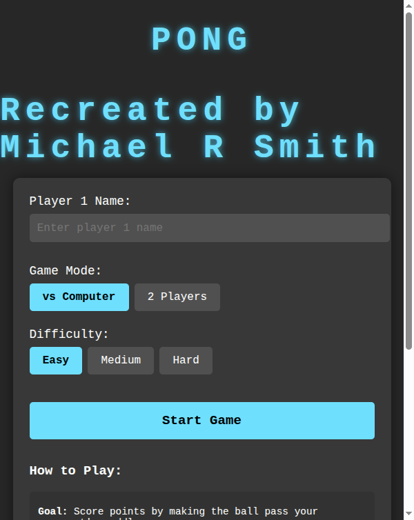

# Sonic Pong

A modern, feature-rich recreation of the classic Pong arcade game — built from scratch with vanilla HTML, CSS, and JavaScript.

**Developed by [Smith Development Labs](https://github.com/MSMITH71910)**

---

## 🎮 Play the Game Live

**[▶ Click here to play Sonic Pong](https://msmith71910.github.io/Sonic_Pong/)**

---

## Screenshot

---

## Features

- **Single Player** — Face off against a computer AI opponent
- **Two Player** — Local multiplayer on the same keyboard
- **3 Difficulty Levels** — Easy, Medium, and Hard (affects AI speed and winning score)
- **High Score Leaderboard** — Top 10 scores saved locally in your browser
- **Sound Effects** — Paddle hits, wall bounces, scoring, game start, game over, and pause sounds
- **Pause Menu** — Pause mid-game and resume or quit
- **Mouse & Keyboard Controls** — Supports both input methods for Player 1
- **Mobile Responsive** — Speed automatically adjusts for smaller screens

---

## How to Play

### Player 1
| Input | Action |
|---|---|
| Mouse (horizontal) | Move paddle |
| `A` key | Move paddle left |
| `D` key | Move paddle right |

### Player 2 (Two Player mode only)
| Input | Action |
|---|---|
| `←` Arrow | Move paddle left |
| `→` Arrow | Move paddle right |

### Game Controls
| Input | Action |
|---|---|
| `Esc` | Pause / Resume |
| Right-click on canvas | Pause |

---

## Difficulty Levels

| Level | Winning Score | AI Reaction |
|---|---|---|
| Easy | 5 points | Slow, predictable |
| Medium | 7 points | Moderate tracking |
| Hard | 10 points | Fast, aggressive |

---

## Built With

- **HTML5** — Game structure and canvas element
- **CSS3** — Styling and layout
- **JavaScript (Vanilla)** — All game logic, AI, animation loop, and local storage

No frameworks. No libraries. Pure web technology.

---

## About Smith Development Labs

**Smith Development Labs** builds custom web applications, games, and business websites for clients in the Philadelphia metro area and beyond. From simple local business landing pages to full interactive web experiences — we bring ideas to life on the web.

> Interested in a custom website or web app for your business?
> **Contact Smith Development Labs** — [github.com/MSMITH71910](https://github.com/MSMITH71910)

---

*Original Pong concept by Atari (1972). This is an independent fan recreation built for educational and portfolio purposes.*
